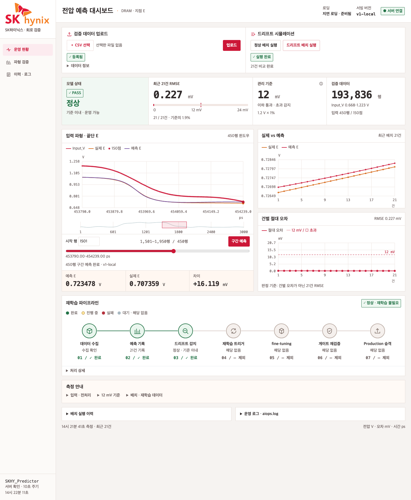
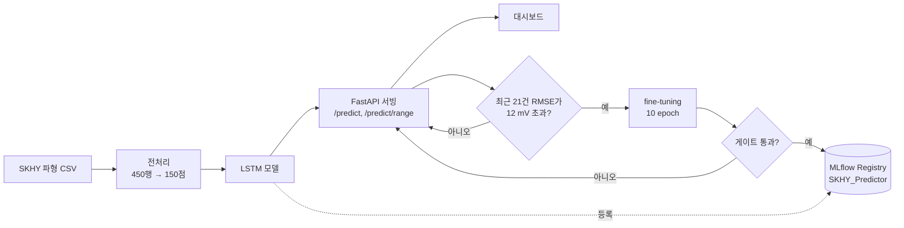
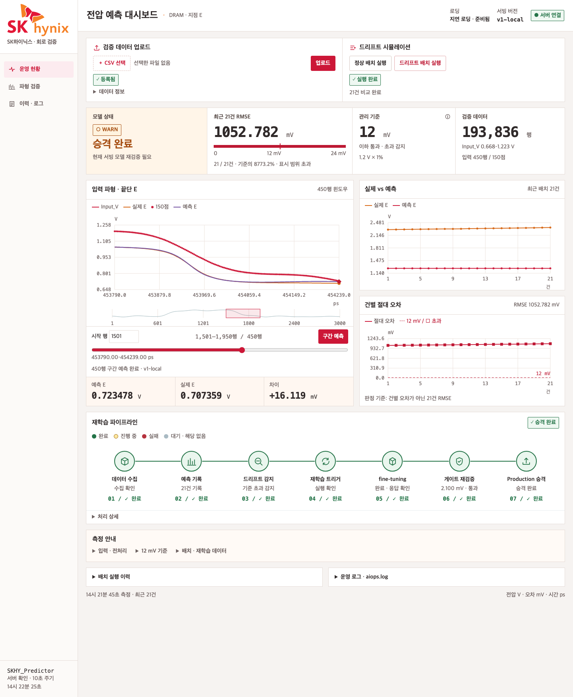

# SKHY 전압 예측 서빙 · AIOps 대시보드

DRAM 회로의 입력 전압 파형(`Input_V`)으로 끝단 지점 **E**의 전압을 예측하는 LSTM 모델을 FastAPI로 서빙하고,
예측 오차가 커지면(드리프트) 감지 → 재학습 → 재승격까지 이어지는 MLOps/AIOps 파이프라인을 웹 대시보드로 확인할 수 있는 프로젝트입니다.



## 목차

1. [프로젝트 소개](#1-프로젝트-소개)
2. [주요 기능](#2-주요-기능)
3. [동작 구조](#3-동작-구조)
4. [데이터와 모델](#4-데이터와-모델)
5. [성능 결과](#5-성능-결과)
6. [빠른 시작](#6-빠른-시작)
7. [대시보드 사용법](#7-대시보드-사용법)
8. [API 명세](#8-api-명세)
9. [드리프트 감지와 재학습](#9-드리프트-감지와-재학습)
10. [프로젝트 구조](#10-프로젝트-구조)
11. [설정](#11-설정)
12. [한계와 향후 과제](#12-한계와-향후-과제)
13. [자료 출처와 라이선스](#13-자료-출처와-라이선스)

## 1. 프로젝트 소개

반도체 회로 검증에서는 신호가 가장 약하고 가장 늦게 도착하는 **끝단 지점 E**의 전압이 허용 범위 안에 있는지가 중요합니다.
이 프로젝트는 입력 파형 `Input_V`만 보고 E의 전압을 예측하는 모델을 만들고, 그 모델을 **운영 중에도 믿을 수 있게** 유지하는 데 초점을 둡니다.

- 입력 파형 450행을 받아 E 전압 예측값을 반환하는 **예측 API**
- 최근 예측 21건의 오차(RMSE)를 지켜보다가 기준을 넘으면 **자동으로 fine-tuning**하고, 검증을 통과한 모델만 **Production으로 승격**
- 위 과정을 한 화면에서 확인하는 **대시보드** (파형 뷰어, 실제 대비 예측 그래프, 7단계 파이프라인, 운영 로그)

## 2. 주요 기능

| 기능 | 설명 |
|---|---|
| 단일 예측 | 연속 450행 `Input_V` → 마지막 입력 다음 시점의 E 1개 |
| 구간 예측 | 선택한 450행 각각의 E를 한 번에 예측해 실제 E와 겹쳐서 비교 |
| 배치 시뮬레이션 | 정상 배치와 드리프트 배치(입력·정답 3배)로 감지 흐름을 재현 |
| 드리프트 감지 | 최근 21건의 RMSE가 12 mV(0.0120 V)를 넘으면 드리프트로 판정 |
| 자동 재학습 | Production 모델의 가중치에서 이어서 짧게 학습(warm start) |
| 모델 레지스트리 | MLflow에 버전을 기록하고, 게이트를 통과한 버전만 Production으로 승격 |
| 운영 로그 | `aiops.log`를 대시보드에서 레벨별로 필터링 |

## 3. 동작 구조



학습·서빙·감시가 하나의 FastAPI 서버(`serving_app/`) 위에 쌓여 있습니다.
모델은 MLflow 레지스트리(또는 로컬 파일)에서 불러오고, 서버가 예측 오차를 계속 기록하면서 드리프트를 판정합니다.

## 4. 데이터와 모델

### 데이터

`data/` 폴더의 CSV 3개는 1 ps(피코초) 간격으로 측정한 전압 파형입니다.

| 파일 | 행 수 | 설명 |
|---|---:|---|
| `SKHY_train.csv` | 452,283 | 학습용. 정답 포함 |
| `SKHY_test_answer.csv` | 193,836 | 평가와 시뮬레이션용. 정답 포함 |
| `SKHY_test_noanswer.csv` | 193,836 | 정답 컬럼(A~E)이 비어 있는 파일. 파이프라인에서는 사용하지 않음 |

컬럼은 `TIME, Input_V, A, B, C, D, E`이고, 이 프로젝트는 **`Input_V`(입력)와 `E`(정답)만** 사용합니다.
값의 범위는 `Input_V` 0.670 ~ 1.231 V, `E` 0.705 ~ 1.075 V입니다. 스케일링은 하지 않고 원본 값을 그대로 씁니다.

### 입력과 정답

```
연속 450행 Input_V ── 3행 간격으로 뽑기 ──▶ 150점 ──▶ LSTM ──▶ 마지막 입력의 2행 뒤(시작 위치 +449행)의 E
```

1 ps 간격이라 바로 옆 행끼리는 값이 거의 같습니다. 그래서 모든 행을 넣는 대신 3행(`INTERVAL`)마다 하나씩 뽑아,
**같은 150개의 숫자로 3배 넓은 구간(450행)** 을 보게 했습니다.

### 모델 구조

```
Input (150, 1)
 → LSTM(32, return_sequences=True)
 → LSTM(32, return_sequences=True)
 → LSTM(16)
 → Dense(16, relu)
 → Dense(1)            # 파라미터 16,097개
```

### 학습 설정

| 항목 | 값 |
|---|---|
| 손실 / 옵티마이저 | MSE / Adam (학습률 1e-3) |
| 배치 크기 / 최대 에폭 | 512 / 30 |
| 조기 종료 | `val_loss` 기준, 5 에폭 연속 개선이 없으면 중단하고 최적 가중치로 복원 |
| 학습·검증 분할 | 시간 순서를 유지해 앞 90% 학습, 뒤 10% 검증 |
| 샘플 시작 간격 (`STRIDE`) | 10행 |

## 5. 성능 결과

저장소에 포함된 모델(`serving_app/models/haic_v1.keras`)로, 윈도우를 한 칸씩 밀어 만든 **모든 샘플**에 대해 측정했습니다.

| 구간 | 샘플 수 | RMSE | MAE | 최대 오차 | 평균값으로 예측할 때 RMSE |
|---|---:|---:|---:|---:|---:|
| 검증 (학습 파일의 뒤 10%) | 44,780 | **6.26 mV** | 4.98 mV | 17.41 mV | 132.86 mV |
| 테스트 (`SKHY_test_answer.csv`) | 193,387 | **6.16 mV** | 4.91 mV | 17.78 mV | 134.88 mV |

- 테스트 RMSE 6.16 mV(0.0062 V)는 **관리 기준 12 mV의 약 51%** 이고, E의 평균값으로 예측할 때보다 오차가 약 22배 작습니다.
- 검증과 테스트 점수가 거의 같아 과적합 징후는 보이지 않습니다.
- 대시보드의 "최근 21건 RMSE"는 서로 **인접한 21개 구간**만 비교하는 값이라, 어느 구간을 뽑느냐에 따라 위 표와 크게 다를 수 있습니다. 두 숫자는 측정 범위가 다릅니다.
- 모델을 다시 학습하면 수치가 달라집니다.

## 6. 빠른 시작

### 요구 사항

Python 3.11에서 개발하고 확인했습니다.

### 설치

```bash
python -m venv venv
source venv/bin/activate        # Windows: venv\Scripts\activate
pip install -r requirements.txt
```

### 모델 준비

서빙용 로컬 모델(`serving_app/models/haic_v1.keras`)은 저장소에 들어 있어서, 바로 서버를 실행해도 예측은 동작합니다.
다만 **드리프트 재학습은 MLflow 레지스트리의 Production 모델에서 이어서 학습**하므로, 처음 한 번은 레지스트리에 모델을 등록해야 합니다.

```bash
python scripts/initialize_local_mlflow.py
```

이 명령은 기존 `runtime/`의 MLflow 저장소가 있으면 `runtime/backups/`로 옮겨 두고, 전체 학습 데이터로 base 모델을 학습해 `SKHY_Predictor`로 등록합니다.
RMSE 게이트(12 mV)를 통과하지 못하면 오류로 종료되고 Production 모델은 등록되지 않습니다.

로컬 모델 파일을 다시 만들고 싶다면 아래 명령을 사용합니다.

```bash
python scripts/train_baseline_v1.py     # serving_app/models/haic_v1.keras 생성
```

### 서버 실행

```bash
uvicorn serving_app.main:app --host 0.0.0.0 --port 8077
```

- 대시보드: <http://localhost:8077/>
- API 문서(Swagger): <http://localhost:8077/docs>

기본값은 로컬 모델 파일로 서빙합니다. MLflow 레지스트리의 Production 모델로 서빙하려면 환경변수를 지정합니다.

```bash
MODEL_SOURCE=mlflow uvicorn serving_app.main:app --host 0.0.0.0 --port 8077
```

## 7. 대시보드 사용법

1. **데이터 업로드**: 왼쪽 위 `CSV 선택`으로 `TIME, Input_V, E` 컬럼이 있는 CSV(최소 650행)를 고르고 `업로드`를 누릅니다. 파일은 서버의 `data/uploads/`에 저장되고, 브라우저에서는 파형을 그립니다.
2. **파형 확인과 구간 예측**: 아래 작은 그래프를 클릭하거나 슬라이더·시작 행으로 450행 구간을 고르고 `구간 예측`을 누릅니다. 이전 449행의 입력 이력이 필요해서 **시작 행이 450 이상**이어야 합니다. 예측 결과는 실제 E 곡선 위에 겹쳐 표시됩니다.
3. **배치 시뮬레이션**: `정상 배치 실행`은 테스트 데이터의 무작위 구간 21건을 예측해 실제 값과 비교합니다. `드리프트 배치 실행`은 같은 구간의 입력과 정답을 3배로 키워 일부러 큰 오차를 만듭니다.
4. **결과 읽기**
   - **모델 상태**: `PASS`(정상), `WARN`(판정 대기·재학습 중·승격 완료 후 재검증 필요), `FAIL`(드리프트 감지·승격 실패)
   - **최근 21건 RMSE**: 게이지의 점선이 관리 기준 12 mV입니다. 구간 예측에서 한 지점의 오차가 12 mV를 넘어도 판정에는 영향이 없고, **판정은 배치 21건의 RMSE**로만 합니다.
   - **재학습 파이프라인**: 데이터 수집 → 예측 기록 → 드리프트 감지 → 재학습 트리거 → fine-tuning → 게이트 재검증 → Production 승격
   - **운영 로그**: `aiops.log`를 `WARN` / `INFO` / `OK` / `ERROR`로 필터링합니다.

대시보드는 오차를 **mV** 단위로 보여 줍니다. (1 V = 1000 mV, 기준 12 mV = 0.0120 V)

맨 위 화면은 정상 배치, 아래 화면은 드리프트 배치를 실행한 결과입니다.



> **참고**: 이 스크린샷은 화면 구성을 보여 주기 위한 예시입니다. 7단계 중 fine-tuning 이후(`게이트 재검증 2.100 mV`, `승격 완료`)는 시연을 위해 대체한 값이며 실제 MLflow 저장소에는 기록되지 않았습니다. 또 드리프트 배치는 일부러 오차를 키운 합성 데이터라서 RMSE가 매우 크게 나옵니다.

## 8. API 명세

입력은 모두 **연속된 `Input_V` 값**이며, 길이가 맞지 않으면 `422` 오류를 반환합니다.

| 메서드 | 경로 | 요청 | 응답 |
|---|---|---|---|
| POST | `/predict` | `{"sequence": [연속 450개]}` | `{"predicted_e", "model_version"}` |
| POST | `/predict/range` | `{"sequence": [연속 899개]}` | `{"predictions": [450개], "model_version"}` |
| POST | `/predict/csv` | CSV 파일(`Input_V` 컬럼). 마지막 450행 사용 | `{"filename", "total_rows", "used_rows", "predicted_e", "model_version"}` |
| POST | `/predict/batch-test` | `{"kind": "normal" \| "drift"}` | `{"predictions": [21], "actuals": [21], "window_rmse", "drift_check"}` |
| POST | `/data/upload` | CSV 파일(`TIME, Input_V, E`, 최소 650행) | `{"filename", "rows"}` |
| GET | `/data/status` | | 최근 업로드 파일 정보 (행 수, 시간·전압 범위) |
| GET | `/models/status` | | 레지스트리의 현재 운영 모델과 버전 이력 |
| GET | `/system/info` | | 전처리·학습·드리프트 설정값 |
| GET | `/metrics/summary?window=5m` | `window`: `5m`, `1h`, `6h`, `24h` | 요청 수, 평균 응답 시간, 성공률, 최근 RMSE 등 |
| GET | `/health` | | `{"status", "model_loaded", "loading_mode"}` |
| GET | `/logs`, `/logs/{filename}` | | 로그 파일 목록과 내용 |

`/predict/range`는 구간 예측용입니다. 선택한 450행의 각 위치에서 직전 450행을 입력으로 쓰므로, 요청은 이전 이력 449행을 포함해 **899행**입니다.

### 호출 예시

```python
import csv
import requests

with open("data/SKHY_test_answer.csv", encoding="utf-8") as f:
    rows = list(csv.DictReader(f))

sequence = [float(r["Input_V"]) for r in rows[1000:1450]]   # 연속 450개
res = requests.post("http://localhost:8077/predict", json={"sequence": sequence})
print(res.json())   # {"predicted_e": 1.0539..., "model_version": "v1-local"}
```

## 9. 드리프트 감지와 재학습

**드리프트**는 시간이 지나 입력 분포가 달라지면서 모델의 예측이 실제와 어긋나기 시작하는 현상입니다.

1. 배치로 예측 21건을 하나씩 기록합니다. 21건 미만이면 판정하지 않습니다(`판정 대기`).
2. 최근 21건의 **RMSE가 0.0120 V(12 mV)를 넘으면** 드리프트로 판정합니다.
3. 드리프트면 **Production 모델의 가중치에서 이어서(warm start)** fine-tuning합니다.
4. 새 모델의 RMSE가 같은 기준(12 mV) 이하일 때만 레지스트리에 등록하고 **Production으로 승격**합니다. 통과하지 못하면 기존 모델을 그대로 유지합니다.

| 항목 | 값 |
|---|---|
| 판정 창 크기 (`WINDOW_SIZE`) | 최근 21건 |
| 드리프트·배포 게이트 기준 (`RMSE_THRESHOLD`) | 0.0120 V (12 mV) |
| fine-tuning | 10 epoch, 학습률 1e-4, 배치 8 |
| fine-tuning 데이터 | 서버 테스트 파일의 마지막 470행 (샘플 21건) |

처음부터 다시 학습하지 않는 이유는, 샘플 21건만으로 LSTM을 새로 학습하면 불안정하기 때문입니다. 이미 전체 데이터로 학습된 모델에서 살짝만 갱신합니다.

`logs/aiops.log`에는 다음 순서로 기록됩니다.

```
[WARN] drift detected - triggering retrain
[INFO] retrain triggered (window=last_21_days)
[OK] new_rmse=0.001519 - production promoted: SKHY_Predictor v6
```

## 10. 프로젝트 구조

```
.
├── data/
│   ├── SKHY_train.csv / SKHY_test_answer.csv / SKHY_test_noanswer.csv
│   ├── voltage_preprocessing.py     # 로딩, 3행 간격 150점 시퀀스, 학습·검증 분할
│   ├── features.py                  # 기존 import 이름을 유지하는 호환 계층
│   └── storage.py                   # 최근 업로드 파일 찾기 (data/uploads/)
├── scripts/
│   ├── initialize_local_mlflow.py   # MLflow 저장소 백업·초기화 + base 모델 등록
│   └── train_baseline_v1.py         # 로컬 모델(haic_v1.keras) 학습
├── serving_app/
│   ├── main.py                      # FastAPI 앱, 라우터 등록, 요청 지표 기록 미들웨어
│   ├── schemas.py                   # 요청·응답 스키마와 입력 길이 검증
│   ├── lstm_model.py                # LSTM 구조 정의
│   ├── model_loader.py              # 로컬 또는 MLflow에서 모델 로드 (lazy / eager)
│   ├── mlflow_config.py             # MLflow 저장소 위치, 실험·모델 이름
│   ├── train_and_register.py        # base 학습 + 게이트 검증 + 등록·승격, fine-tuning
│   ├── monitoring/
│   │   ├── drift_detector.py        # 최근 21건 RMSE로 드리프트 판정
│   │   └── retrain_trigger.py       # 드리프트 시 재학습 실행과 로그 기록
│   ├── routers/                     # predict, data, models, system, metrics, health, logs
│   ├── models/haic_v1.keras         # 서빙용 로컬 모델
│   └── static/skhy.html             # 대시보드
├── runtime/                         # MLflow DB·아티팩트 (Git 제외, 자동 생성)
├── logs/                            # aiops.log, requests.log (Git 제외, 자동 생성)
├── docs/images/                     # README 스크린샷
└── requirements.txt
```

## 11. 설정

### 환경변수

| 변수 | 기본값 | 설명 |
|---|---|---|
| `MODEL_SOURCE` | `local` | `local`: `serving_app/models/haic_v1.keras` / `mlflow`: 레지스트리의 Production 모델 |
| `LOADING_MODE` | `lazy` | `lazy`: 첫 예측 요청 때 로드 / `eager`: 서버 시작 때 로드 |
| `MLFLOW_TRACKING_URI` | `sqlite:///<프로젝트>/runtime/mlflow.db` | MLflow 저장소 위치 |

### 주요 상수

| 상수 | 값 | 위치 |
|---|---|---|
| `SEQUENCE_LENGTH` / `INTERVAL` / `STRIDE` / `TRAIN_RATIO` | 150 / 3 / 10 / 0.9 | `data/voltage_preprocessing.py` |
| `RMSE_THRESHOLD` / `WINDOW_SIZE` | 0.012 / 21 | `serving_app/monitoring/drift_detector.py` |
| `MODEL_NAME` / `EXPERIMENT_NAME` | `SKHY_Predictor` / `SKHY_Voltage` | `serving_app/mlflow_config.py` |

현재 적용된 값은 `GET /system/info`로도 확인할 수 있습니다.

## 12. 한계와 향후 과제

- **승격해도 서버가 모델을 바꾸지 않습니다.** 서버는 처음 불러온 모델을 메모리에 캐시하고 다시 불러오지 않아서, 새 버전이 Production으로 승격돼도 **서버를 재시작하기 전까지는 이전 모델로 예측**합니다. 대시보드의 `승격 완료 · 현재 서빙 모델 재검증 필요` 표시가 이 때문입니다.
- **재학습 데이터가 실제 드리프트 데이터가 아닙니다.** fine-tuning은 서버가 가진 테스트 파일의 마지막 470행으로 하고, 드리프트 배치는 입력·정답을 3배로 키운 합성 데이터입니다. 감지에서 승격까지의 **흐름을 검증하는 용도**이며, 실제 분포 변화에 대한 적응 성능을 보장하지 않습니다.
- **드리프트 판정 기록은 서버 메모리에 있습니다.** 서버를 재시작하면 최근 21건이 초기화되어 `판정 대기`로 돌아갑니다.
- **21건은 서로 인접한 구간**이라 구간에 따라 RMSE 편차가 큽니다. 기준 근처의 값에서는 판정이 흔들릴 수 있습니다.
- **입력은 `Input_V` 하나뿐입니다.** 데이터에 있는 A~D 지점은 사용하지 않았고, 예측 대상은 지점 E 하나입니다.
- **Docker 설정은 현재 구조에 맞지 않습니다.** `serving_app/Dockerfile`과 `docker-compose.yml`은 이전 버전 기준이라 지금은 사용하지 않습니다.

## 13. 자료 출처와 라이선스

- `data/`의 SKHY 전압 파형 CSV는 **교육 과정에서 제공된 자료**입니다. 학습 목적으로만 사용하고, 저장소 밖으로 공개하거나 재배포하지 마세요.
- 이 프로젝트의 서빙·MLOps·AIOps 구조는 교육 과정의 *"HAIC 모델 서빙 및 AIOps 3일 실습 스켈레톤"* 을 바탕으로 SKHY 전압 데이터에 맞게 확장한 것입니다.
- 별도의 오픈소스 라이선스는 지정하지 않았습니다.
